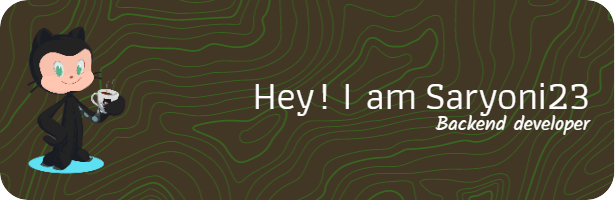

<a href="https://github.com/saryoni23">
  

  
  

</a>

    
    
    
    

<h1 align="center">👋  About Me</h1>

Hey there

 

Hello Everyone... Introduce my name is Indra Saryoni Simanjuntak. I am a Backend Developer from Medan city. Currently, I am a Backend developer and focus on PHP, especially on the Codeigniter framework. Currently, I still like coding and consider coding part of my hobby. And on the sidelines of busy coding, I always learn about new things such as learning new frameworks or anything that will work later to develop the applications that I make, And this is a small part of me. If you are interested or want to ask about me then contact me via the form below

Want to know more about me? [Check out my portfolio.](https://saryoni23.github.io/)

 

## 📝 Latest Blog Posts

 

<!-- BLOG-POST-LIST:START -->
- [Panduan utama untuk shortcut keyboard di Windows 11](https://indrasaryoni.blogspot.com/2022/04/panduan-utama-untuk-shortcut-keyboard.html)
<!-- BLOG-POST-LIST:END -->
 

## 📌 Pinned Repositories

 
<a href="https://github.com/saryoni23/AdndroidRecognizeText">

</a>

<a href="https://github.com/saryoni23/aplikasi-pendaftaran-bimbingan-belajar-berbasis-web-menggunakan-php">

</a>

<a href="https://github.com/saryoni23/bacend-aplikasi-safety-panli-php-api-php_sederhana">

</a>

<a href="https://github.com/saryoni23/aplikasi-rental-motor-berbasis-web-menggunakan-framework-ci">

</a>

 

## &#x1f4c8; GitHub Stats & Languages 

 

<summa ry>GitHub Stats</summa>
 
<a href="https://github.com/saryoni23"> 

</a>

 

languages

<a href="https://github.com/saryoni23">

</a>
 

chart

<a href="https://profile.codersrank.io/user/saryoni23/" rel="nofollow">

</a>

 

## 💼 Skills

  

More Skills

  

  

 
